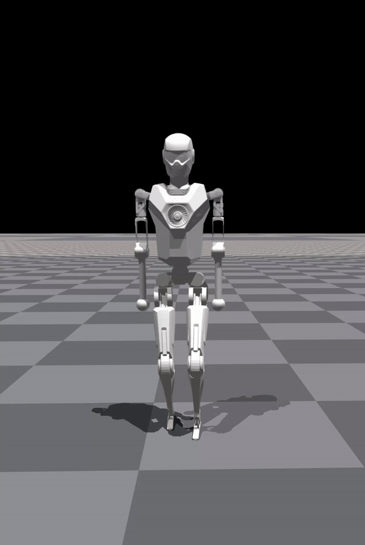

# X02-Gym: Reinforcement Learning for Humanoid Robot</a>

<div style="text-align: center;">
   
   
   
</div>

X02-Gym is an easy-to-use reinforcement learning (RL) framework based on Nvidia Isaac Gym, designed to train locomotion skills for humanoid robots, emphasizing zero-shot transfer from simulation to the real-world environment. X02-Gym also integrates a sim-to-sim framework from Isaac Gym to Mujoco that allows users to verify the trained policies in different physical simulations to ensure the robustness and generalization of the policies.

This codebase is verified by Droid X02 in real-world environment with zero-shot sim-to-real transfer.

## Features

### 1. Droid Robot Training
This repository offers comprehensive guidance and scripts for the training of humanoid robots. X02-Gym features specialized rewards for humanoid robots, simplifying the difficulty of sim-to-real transfer. In this repository, we use Droid's X02 as a primary example. It can also be used for other robots with minimal adjustments. Our resources cover setup, configuration, and execution. Our goal is to fully prepare the robot for real-world locomotion by providing in-depth training and optimization.

- **Comprehensive Training Guidelines**: We offer thorough walkthroughs for each stage of the training process.
- **Step-by-Step Configuration Instructions**: Our guidance is clear and succinct, ensuring an efficient setup process.
- **Execution Scripts for Easy Deployment**: Utilize our pre-prepared scripts to streamline the training workflow.

### 2. Sim2Sim Support
We also share our sim2sim pipeline, which allows you to transfer trained policies to highly accurate and carefully designed simulated environments. Once you acquire the robot, you can confidently deploy the RL-trained policies in real-world settings.

Our simulator settings, particularly with Mujoco, are finely tuned to closely mimic real-world scenarios. This careful calibration ensures that the performances in both simulated and real-world environments are closely aligned. This improvement makes our simulations more trustworthy and enhances our confidence in their applicability to real-world scenarios.


## Installation

1. Generate a new Python virtual environment with Python 3.8 using `conda create -n droid_gym python=3.8`
2. And using `conda activate droid_gym`
3. For the best performance, we recommend using NVIDIA driver version 550 `sudo apt install nvidia-driver-550`. The minimal driver version supported is 550. If you're unable to install version 550, ensure that your system has at least version 535 to maintain basic functionality.
4. Install PyTorch with Cuda:
   - `conda install pytorch torchvision torchaudio pytorch-cuda -c pytorch -c nvidia `
5. Install numpy with `conda install numpy`
6. Install Isaac Gym:
   - Download and install Isaac Gym Preview 4 from https://developer.nvidia.com/isaac-gym.
   - `cd isaacgym/python && pip install -e .`
   - Run an example with `cd examples && python 1080_balls_of_solitude.py`
   - Consult `isaacgym/docs/index.html` for troubleshooting.
7. Install X02-Gym:
   - Clone this repository.
   - `cd droid_gym && pip install -e .`


## Usage Guide

#### Examples

```bash
# Launching PPO Policy Training for 'v1' Across 4096 Environments
# This command initiates the PPO algorithm-based training for the humanoid task.
python scripts/train.py --task=x02_ppo --run_name v1 --headless --num_envs 4096

# Evaluating the Trained PPO Policy 'v1'
# This command loads the 'v1' policy for performance assessment in its environment. 
# Additionally, it automatically exports a JIT model, suitable for deployment purposes.
python scripts/play.py --task=x02_ppo --run_name v1 --num_envs 64

# Implementing Simulation-to-Simulation Model Transformation
# This command facilitates a sim-to-sim transformation using exported 'v1' policy.
# You can use keys 2, 3, 4, 5, 6, 7 , 0 to control the robot's forward, backward, left, right, forward-left, forward-right speeds and walking in place.
python scripts/sim2sim.py 

```

## Troubleshooting

Observe the following cases:

```bash
# error
ImportError: libpython3.8.so.1.0: cannot open shared object file: No such file or directory

# solution
# set the correct path
export LD_LIBRARY_PATH="~/miniconda3/envs/your_env/lib:$LD_LIBRARY_PATH" 

# OR
sudo apt install libpython3.8

# error
AttributeError: module 'distutils' has no attribute 'version'

# solution
# install pytorch 1.12.0
conda install pytorch torchvision torchaudio cudatoolkit=11.3 -c pytorch

# error, results from libstdc++ version distributed with conda differing from the one used on your system to build Isaac Gym
ImportError: /home/droid/anaconda3/bin/../lib/libstdc++.so.6: version `GLIBCXX_3.4.20` not found (required by /home/droid/carbgym/python/isaacgym/_bindings/linux64/gym_36.so)

# solution
mkdir ${YOUR_CONDA_ENV}/lib/_unused
mv ${YOUR_CONDA_ENV}/lib/libstdc++* ${YOUR_CONDA_ENV}/lib/_unused
```
## Directory Structure
```
.
|— humanoid           # Main code directory
|  |—algo             # Algorithm directory
|  |—envs             # Environment directory
|  |—scripts          # Script directory
|  |—utilis           # Utility and function directory
|— logs               # Model directory
|— resources          # Resource library
|  |— robots          # Robot urdf, mjcf, mesh
|— README.md          # README document
```

> References
> * [GitHub - leggedrobotics/legged_gym: Isaac Gym Environments for Legged Robots](GitHub - leggedrobotics/legged_gym: Isaac Gym Environments for Legged Robots)
> * [GitHub - leggedrobotics/rsl_rl: Fast and simple implementation of RL algorithms, designed to run fully on GPU.](https://github.com/leggedrobotics/rsl_rl)
> * [GitHub - roboterax/humanoid-gym: Humanoid-Gym: Reinforcement Learning for Humanoid Robot with Zero-Shot Sim2Real Transfer https://arxiv.org/abs/2404.05695](https://github.com/roboterax/humanoid-gym)

## Acknowledgment

The implementation of Humanoid-Gym relies on resources from [legged_gym](https://github.com/leggedrobotics/legged_gym) and [rsl_rl](https://github.com/leggedrobotics/rsl_rl) projects, created by the Robotic Systems Lab. We specifically utilize the `LeggedRobot` implementation from their research to enhance our codebase.

## Any Questions?

If you have any more questions, please contact [support@droidup.com](mailto:support@droidup.com) or create an issue in this repository.